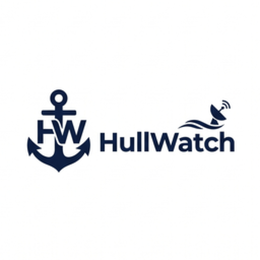
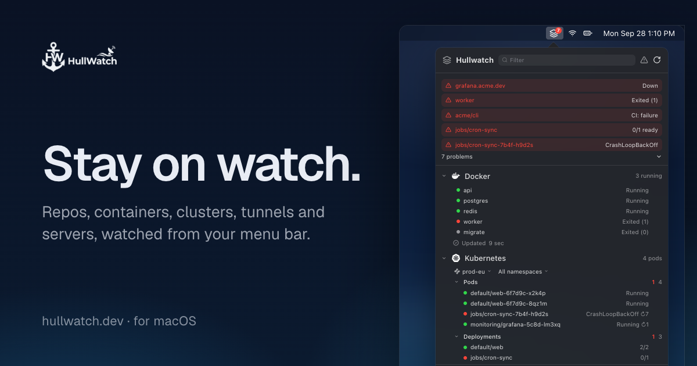

<h2>HullWatch</h2>

Repos, containers, clusters, tunnels and servers, watched from your Mac menu bar. Docker, Kubernetes, GitHub, GitLab, Cloudflare, Proxmox, Vercel, Netlify and more, in one panel.

 

<b>macOS 14 Sonoma or later</b> · Apple silicon &amp; Intel · 3-day free trial included 
<a href="https://hullwatch.dev/download">Download page</a> ·
<a href="https://hullwatch.dev/changelog">Changelog</a> ·
<a href="https://hullwatch.dev/faq">FAQ</a>

 

> [!NOTE]
> HullWatch is **not** open source. This repository does **not** contain its source code. It hosts the public [issue tracker](https://github.com/LeonimusTTV/hullwatch/issues) for bug reports and feature requests, and the [changelog](CHANGELOG.md).

> [!WARNING]
> **Please beware of lookalike websites offering downloads or asking for payment.**
> The only official site is [hullwatch.dev](https://hullwatch.dev), and the GitHub repository is [LeonimusTTV/hullwatch](https://github.com/LeonimusTTV/hullwatch).

## About HullWatch

**HullWatch** watches your infrastructure from the macOS menu bar. It polls the services you already use and surfaces problems as soon as they happen: **down containers, failing pipelines, expiring certificates, unhealthy pods, offline tunnels** and more. You don't need to open a dashboard.

The menu bar icon shows a badge with the number of items that need attention, and **notifications** tell you when something breaks and when it's back to healthy. Each section reports a health state (healthy, warning, critical or unknown) and comes with one-click actions such as restarting a container, muting an alert or opening a pull request.

It's a native Mac utility, not a hosted dashboard or SaaS. There is no account to create, your API tokens stay in your macOS Keychain, and **HullWatch does not collect any data**.

## Key Features

Sixteen instruments, one panel. Turn on only the sections you use, reorder them, and set each one's refresh interval in **Settings → Sections**. Every item comes with actions, so you can fix things right from the menu bar.

- **Docker:** Container status and exit codes. Start, stop, restart or remove a container, show its logs, follow them in Terminal, or open a shell inside it.
- **Kubernetes:** Pods and deployments per context and namespace. Show or follow logs, open a shell, delete a pod, do a rollout restart, **forward a pod's port to localhost**, and switch kubectl's current context.
- **GitHub:** GitHub Actions workflow runs, pull requests, issues and review requests for the repositories you pick.
- **GitLab:** Pipelines, merge requests and issues for your GitLab projects, on gitlab.com or your own instance.
- **Domains & TLS:** Warnings a configurable number of days before a domain registration or TLS certificate expires.
- **Cloudflare:** Domains with their traffic, and tunnels. **Create a new tunnel**, open a tunnel's public hostname, or delete it.
- **Proxmox:** Virtual machines and LXC containers on your Proxmox hosts, with start, shutdown and reboot.
- **Deployments:** Vercel and Netlify deployments.
- **Uptime:** HTTP checks against the URLs you choose, with an on-demand **Check now**.
- **Service status:** The public status pages of the third-party services you depend on.
- **Git repos:** Ahead/behind counts, uncommitted and untracked changes, and conflicts in your local repositories. Fetch, open in Terminal or your editor, or reveal in Finder. Add a folder and HullWatch finds the repositories inside it.
- **Homebrew:** Start, stop and restart Homebrew services, and upgrade outdated packages in Terminal.
- **Disk:** Free space and reclaimable caches. Clean caches, prune unused Docker data, or move files to the Trash.
- **Ports:** TCP ports your own processes listen on. Quit a process, or **expose a local port with a Cloudflare tunnel**.
- **Links:** Shortcuts to anything with a URL: `https://`, `vscode://`, `raycast://` and more.
- **Quick tools:** Decode JWTs, Base64 and URL encode/decode, format or minify JSON, convert timestamps, hash with SHA-256 and generate UUIDs.

**Keyboard shortcut:** open the panel from anywhere with a global shortcut you set in **Settings → General**.

**Notifications:** choose which alerts you get in **Settings → Notifications**, and mute the noisy ones from the panel.

**Light on your Mac:** sections refresh less often while the panel is closed and refresh right away when you open it. Refreshing pauses while your Mac sleeps and slows down in Low Power Mode.

[See it live on hullwatch.dev](https://hullwatch.dev) · [View planned enhancements](https://github.com/LeonimusTTV/hullwatch/issues?q=is%3Aissue+is%3Aopen+label%3Aenhancement)

## License and Pricing

HullWatch is a **one-time purchase, not a subscription**. Buy a license at **[hullwatch.dev](https://hullwatch.dev/download)**. The regular price is **$18**, and the current launch offer is **$9 (50% off)**.

- **3-day free trial:** every download includes a free trial, so you can try HullWatch before you buy. When the trial ends, enter a license key to keep using it.
- **3 Macs per license:** one license works on up to 3 Macs. To move it to another Mac, choose **Remove License from This Mac** in **Settings → License**, or manage your Macs in the customer portal.
- **Free updates:** every update is included with your license, at no extra cost.
- **14-day refund:** you can request a refund within 14 days of purchase, no questions asked. Email **[contact@leonimust.com](mailto:contact@leonimust.com)**.

Your license key is in your purchase email and in the customer portal. Payments are processed by [Polar](https://polar.sh).

## Installation

1. [Download HullWatch](https://hullwatch.dev/HullWatch.dmg) from the official website.
2. Open the downloaded `.dmg` file.
3. Drag HullWatch to the `Applications` folder.
4. Open HullWatch. It lives in your menu bar.

HullWatch is signed and notarized by Apple.

### Updates

Updates are free. HullWatch updates itself: it checks for new versions automatically, and you can choose to download and install them automatically too. You can also check by hand at any time with **Check for Updates…**, or **Check now** in **Settings → General**. Release notes are in the [changelog](CHANGELOG.md).

Your current version is shown in **Settings → General → About**.

## Using the App

Click the HullWatch icon in the menu bar, or press your keyboard shortcut, to open the panel. Open **Settings…** to connect your services. Each section explains what it needs, such as a read-only API token. API tokens are stored in your macOS Keychain. Turn on **Launch HullWatch at login** in **Settings → General**.

Answers to common questions are in the [FAQ](https://hullwatch.dev/faq).

## Reporting Bugs and Requesting Features

All feedback goes through this repository's issue tracker:

- 🐞 **[Report a bug](https://github.com/LeonimusTTV/hullwatch/issues/new?template=bug_report.yml)**
- ✨ **[Request a feature or integration](https://github.com/LeonimusTTV/hullwatch/issues/new?template=feature_request.yml)**

Please search [existing issues](https://github.com/LeonimusTTV/hullwatch/issues) first, and add a 👍 to the ones that matter to you. **Never paste API tokens, hostnames or other private data into an issue.**

For license, purchase or refund questions, email [contact@leonimust.com](mailto:contact@leonimust.com) instead of opening an issue.

## Compatibility

- **macOS:** macOS 14 Sonoma or later.
- **Hardware:** Apple silicon and Intel Macs.

## Localization

HullWatch is available in **English** and **French**.

## Contact

- **Official website:** [hullwatch.dev](https://hullwatch.dev)
- **Bug reports and feature requests:** [GitHub Issues](https://github.com/LeonimusTTV/hullwatch/issues/new/choose)
- **License, purchase and refunds:** [contact@leonimust.com](mailto:contact@leonimust.com)

HullWatch is developed by [@LeonimusTTV](https://github.com/LeonimusTTV).
